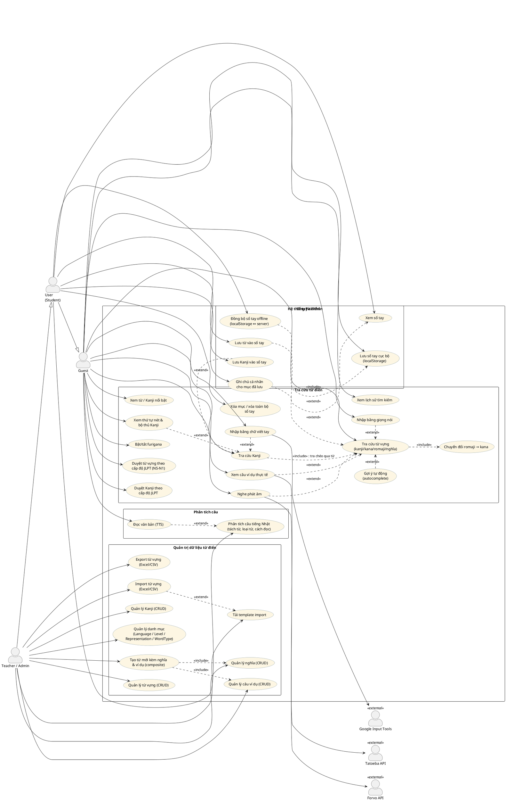
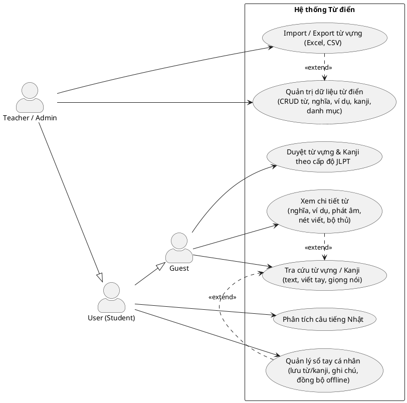

# Use Case Diagram — Chức năng Từ điển (Dictionary / Words)

Tài liệu mô tả use case cho module từ điển, tổng hợp từ:

- **Backend**: `system/dictionary/` (DictionaryController, NotebookController), `system/words/` (Word, Meaning, Example, Kanji, Language, Level, Representation, WordType, WordKanji — auto-CRUD), `system/analyze/` (SudachiTokenizer)
- **Frontend**: `pages/dictionary/` (DictionaryPage, VocabularyBrowsePage, NotebookPage, WordCreatePage), `pages/analyze/AnalyzePage`

## Actor

| Actor | Mô tả |
|---|---|
| **Guest** | Người dùng chưa đăng nhập. Mọi endpoint `/api/dictionary/*` (trừ notebook) đều public. Sổ tay chỉ lưu localStorage. |
| **User (Student)** | Đã đăng nhập. Kế thừa toàn bộ Guest + sổ tay đồng bộ server + phân tích câu. |
| **Teacher/Admin** | Kế thừa User + quản trị dữ liệu từ điển (CRUD, import/export) theo permission `WORD_*`, `KANJI_*`, ... |
| **Tatoeba** (external) | API câu ví dụ thực tế. |
| **Forvo** (external) | API âm thanh phát âm (fallback TTS). |
| **Google Input Tools** (external) | API nhận dạng chữ viết tay kanji. |

## PlantUML

## Diagram rút gọn (bản trình bày / báo cáo)

Bản đầy đủ ở trên khá dày; nếu cần đưa vào slide/báo cáo, dùng bản gom nhóm này:

## Bảng ánh xạ Use case ↔ Endpoint

| Use case | Endpoint | Quyền |
|---|---|---|
| Tra cứu từ vựng | `GET /api/dictionary/search` | Public |
| Gợi ý tự động | `GET /api/dictionary/suggest` | Public |
| Tra cứu Kanji | `GET /api/dictionary/kanji-search` | Public |
| Duyệt từ vựng | `GET /api/dictionary/browse/words` | Public |
| Duyệt Kanji | `GET /api/dictionary/browse/kanjis` | Public |
| Từ/Kanji nổi bật | `GET /api/dictionary/featured` | Public |
| Câu ví dụ thực tế | `GET /api/dictionary/examples` (→ Tatoeba) | Public |
| Nghe phát âm | `GET /api/dictionary/audio` (→ Forvo / TTS) | Public |
| Nhận dạng chữ viết tay | `POST /api/dictionary/handwriting` (→ Google Input Tools) | Public |
| Phân tích câu | `POST /api/analyze` (Sudachi) | Đăng nhập |
| Xem sổ tay | `GET /api/dictionary/notebook` | Đăng nhập |
| Lưu / xóa từ trong sổ tay | `POST/DELETE /api/dictionary/notebook/words/{wordId}` | Đăng nhập |
| Lưu / xóa kanji trong sổ tay | `POST/DELETE /api/dictionary/notebook/kanjis/{character}` | Đăng nhập |
| Ghi chú cá nhân | `PUT /api/dictionary/notebook/entries/{entryId}/note` | Đăng nhập |
| Xóa toàn bộ sổ tay | `DELETE /api/dictionary/notebook` | Đăng nhập |
| Đồng bộ offline | `POST /api/dictionary/notebook/sync` | Đăng nhập |
| Tạo từ composite | `POST /api/dictionary/words` | `WORD_CREATE` |
| CRUD từ vựng | `/api/words/*` (auto-CRUD) | `WORD_*` |
| CRUD nghĩa | `/api/meanings/*` (auto-CRUD) | `MEANING_*` |
| CRUD ví dụ | `/api/examples/*` (auto-CRUD) | `EXAMPLE_*` |
| CRUD Kanji | `/api/kanjis/*` (auto-CRUD) | `KANJI_*` |
| CRUD danh mục | `/api/languages`, `/api/levels`, `/api/representations`, `/api/word-types` | `LANGUAGE_*`, `LEVEL_*`, ... |
| Export từ vựng | `GET /api/dictionary/words/export` | `WORD_READ` |
| Import từ vựng | `POST /api/dictionary/words/import` | `WORD_CREATE` |
| Tải template | `GET /api/dictionary/words/template` | `WORD_CREATE` |

## Ghi chú thiết kế

- **Guest dùng được gần như toàn bộ tra cứu**: mọi endpoint `/api/dictionary/*` (trừ `notebook`) đều nằm trong `PUBLIC_ENDPOINTS` của `SecurityConfig`. Sổ tay của Guest chỉ lưu localStorage (`dict_saved_words`, `dict_saved_kanjis`) — khi đăng nhập sẽ merge lên server qua `POST /notebook/sync`.
- **Tra cứu Kanji include tra cứu từ**: `DictionaryServiceImpl.searchKanji` có chiến lược 3 bước — tra trực tiếp ký tự → tra keyword → tra chéo qua kết quả tìm từ (vd nhập romaji "seijin" → tìm ra 成人 → tách 成, 人).
- **Sổ tay scoped theo user**: `NotebookController` luôn lấy `principal.getId()`, client không truyền userId — không có truy cập chéo người dùng.
- **Quản trị qua auto-CRUD**: các entity Word/Meaning/Example/Kanji/... gắn `@AutoCrud` + `@ResourcePermission`, endpoint sinh tự động, không có controller riêng (xem [[words-autocrud-no-controllers]] trong memory).